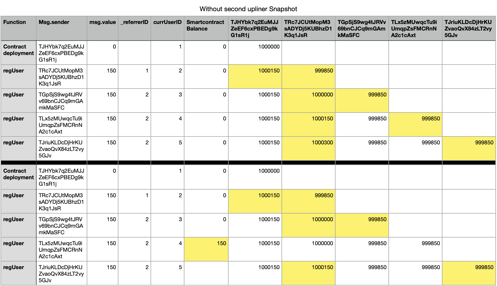

# BC_Tron_MLM

## Contract Deployment

### Function call Values
    Function : Contract deployment	\
    Msg.sender : TJHYbk7q2EuMJJZeEF6cxPBEDg9kG1sR1j \
    msg.value : 0 \
    _referrerID : 0

## User Registration
### Function call Values
    Function : regUser	\
    Msg.sender : TRc7JCUtMopM3sADYDj5KUBhzD1K3q1JsR \
    msg.value : 150 \
    _referrerID : 1

    *Tron Balance Before*
    TJHYbk7q2EuMJJZeEF6cxPBEDg9kG1sR1j : 1000000
    TRc7JCUtMopM3sADYDj5KUBhzD1K3q1JsR : 1000000

    *Tron Balance After*
    TJHYbk7q2EuMJJZeEF6cxPBEDg9kG1sR1j : 1000150
    TRc7JCUtMopM3sADYDj5KUBhzD1K3q1JsR : 999850

### After added 3 people in level1 of user1 who has owner as referrer

### After second referral transfer amount to contract

## tronbox
### tronbox runtime environment
install docker
docker pull tronbox/tre
docker run -it \
-p 8080:8080 \
--rm \
--name tron \
tronbox/tre

### tronbox project setup
npm install -g tronbox
tronbox init
replace private key in tronbox.js

### Handling tronbox
tronbox compile
tronbox migrate

Available Accounts
==================

(0) TTsBdY1mdfym5KGF4QCduQeGhcREpL61fo (10000 TRX)
(1) TCSqQdiX2y96k5Rm8ZBJbfLN7K9CRSsnAz (10000 TRX)
(2) TEEFE7J8rTLZwMy3KWv7Aide77F2wzjSj7 (10000 TRX)
(3) TZ4uZs62sJRPvLioP9rmuetrKvwsPSYqxq (10000 TRX)
(4) TFZhHMpTrrVQ4FJWZC49Kv8NAVUj5HmLJf (10000 TRX)
(5) TCAdgh5cDY7XnYXxJN1yA5z1sezo4cmhJo (10000 TRX)
(6) TGCKJ9jYraELyABdiUAwT9o7XqCh3AnCiT (10000 TRX)
(7) TNRdup7ExGvnr7pjzscoqxKkBGNiXUc4th (10000 TRX)
(8) TSHnpqJAms5YyKuqknQDBnCptoDv7pXf1r (10000 TRX)
(9) THfq1VXP4hyLfkG35dL3sjeomC5UHA2zVb (10000 TRX)

Private Keys
==================

(0) 1c47522abee59a3af73b30ce2377f2bd31941fec9f2e2d1d89d35c49e78284eb
(1) fdc18c43e8fead3d1aed20d8efbdf9bd512976767eeb09a5e6bb4bf1bddde324
(2) c20b56a503b734d05e36f868cbf1188bb3053dfd6e121bd99f357ecfee8eaf7e
(3) 439fedca03d2df3586bc2838e31e8a97e974a29aad95514f610e3717bbb88bee
(4) c25dccdf7f2f225212dc536a47a35be01c9720147dbf30ad077140822d6c2c50
(5) d56305c2ff33ef1bf64ff7115792d401d2db3f43e1d17ae198aba0ad053ea062
(6) 57e79173e6fba35e71413f016ce76ff7f6fae989e0e087d85220d976cdc8a98d
(7) b3f9279db9021ee96f127a6b0a76a84bb008727facdfd67d7e093e4c9b2882a0
(8) 9577e258388a7f6439c83d9994c64dac99d0eb8c9535c2797a3320ef8fcb5ec2
(9) 9cb62b7767307ce41dfdeea435097411e969edfaf0039e6d383bc72becc4fd11